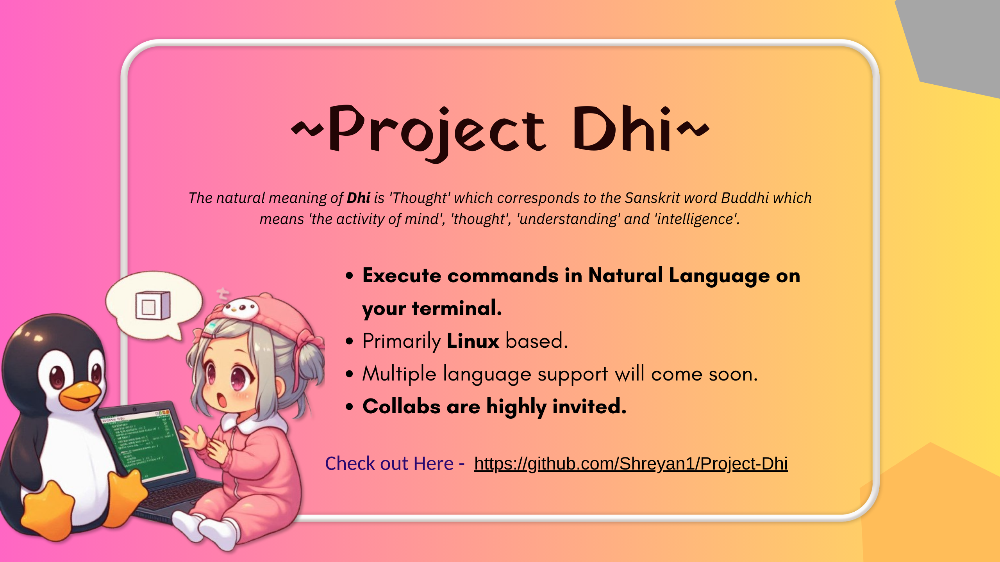
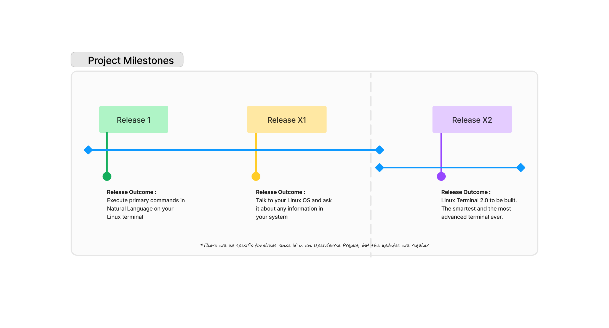

# Project-Dhi

- Execute commands in Natural Language on your terminal. 
- Multiple language support will come soon. 
- Collabs are highly welcome.

## Installation 💾

Supported OS : Linux (Debian, Arch, ...)

work in progress
|
coming soon | 

For starters - 
1. `pip install -r requirements.txt`
2. `chmod +X run.sh`
3. `./run.sh`

   
## Collab work : 🤝
- Need help with to populate the SQLite DB with more appropriate commands
- Suggest better way to train the model on basis of various user natural responses

## Release Plan : ⏳

Note : I understand that using OpenAI API model will solve all the barriers here but that is exactly the dependency I want to remove. 
       Hence, I need it to be run locally, even without access to the internet.
