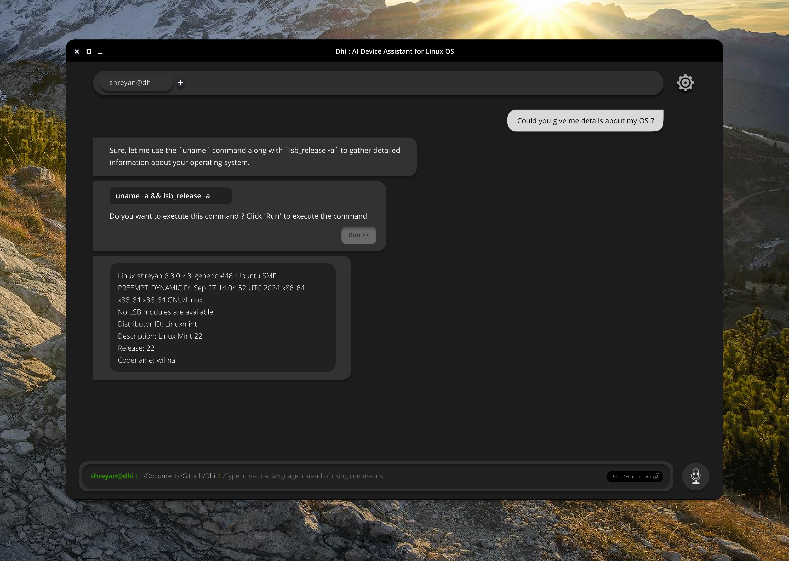

# Project-Dhi


- Execute commands in Natural Language on your terminal.
- Multiple language support coming soon.
- Collaborations are highly invited.

## OpenSource Contributions/ Collab open for : 👨‍💻 
- **GenAI/RAG :**
   - Work on the GenModel Approach to better train the command generation model (Will be uploaded to HF with proper contributor credits)
   - Reduce the retreival time using efficient vectordb for the Approach3.py file
   - Work on Database Caching techniques for faster RAG approaches.
- **Frontend :**
   - Work on the UI below using ElectronJS (Figma file would be provided)

## Installation 💾

**Supported OS:** Linux (Debian, Arch, ...)

For starters:
1. Clone the repository:
   ```
   git clone https://github.com/yourusername/Project-Dhi.git
   cd Project-Dhi
   ```

2. Run the setup script:
   ```
   chmod +x run.sh
   source run.sh -S
   ```

   This will:
   - Create a virtual environment (if it doesn't exist)
   - Activate the virtual environment
   - Install all required dependencies

3. To run Project Dhi:
   ```
   source run.sh
   ```

## Usage 🖥️

- After installation, simply run `source run.sh` to start Project Dhi.
- Type your natural language commands, and Project Dhi will interpret and execute them on your terminal.

## UI Design Prototype


#### We need collaborators who can work with Electron js to build this UI.

## Development 🛠️

To set up the development environment:

1. Create and activate the virtual environment:
   ```
   source run.sh -V , or
   source run.sh --venv
   ```

2. Install dependencies:
   ```
   source run.sh -I , or
   source run.sh --install
   ```

3. Silent Install function: [Best Way]
   ```
   source run.sh -S , or
   source run.sh --silent
   ```
3. For debugging, use the `-D` flag:
   ```
   source run.sh -D , or
   source run.sh --debug
   ```

You can use ```source run.sh --help``` for accessing the help section for more details.

## Collaboration Opportunities 🤝

- Help populate the DB with more appropriate commands and descriptions.
- Suggest ways to train the model based on various user natural responses.
- Contribute to making Project Dhi lightweight and independent of heavy resource utilization.

## Release Plan ⏳


Note: We understand that using OpenAI API model would solve many barriers, but that's exactly the dependency we want to remove. 
Hence, Project Dhi is designed to run locally, without access to the internet. Our goal is to make it lightweight, fast and independent of any heavy resource or internet utilizations.
Well, except for the one-time unavoidable pip requirements installation.

## Contact 📧

<a href="shreyan.github@gmail.com" style="margin: 0 15px;">

</a>

<a href="https://www.linkedin.com/in/shreyanbasuray/" style="margin: 0 15px;">

</a>